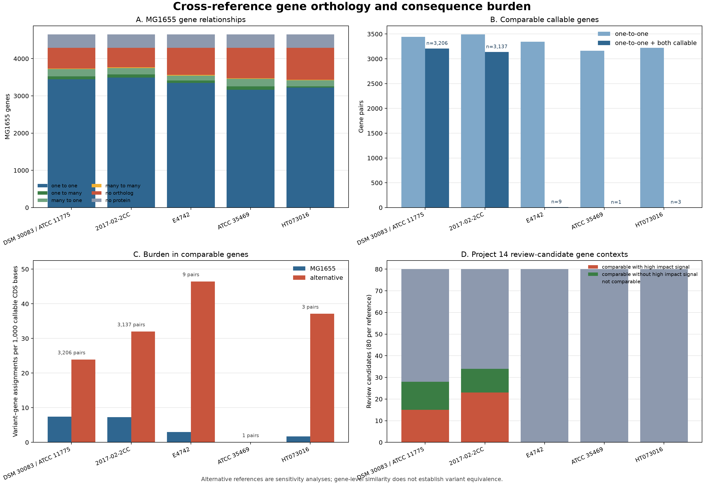

# Project 15 — Cross-Reference Gene Orthology & Consequence Explorer

[](https://github.com/pankhilpandya01-star/bioinformatics-project-15-cross-reference-gene-orthology-consequence-explorer/actions/workflows/tests.yml)


Project 15 tests whether Project 14's gene-level conclusions remain similar
when the same public *Escherichia coli* sample is evaluated against the five
alternative references screened in Project 13.

```text
Project 14: What might the MG1655-relative variants change?
Project 15: Do corresponding genes show similar evidence with other references?
```

The central question is:

> Which MG1655 genes have reliable one-to-one orthologs in the alternative
> references, and how much does their predicted consequence burden change with
> reference choice?

The comparison operates at the gene level. It does not claim that variants at
different reference coordinates are the same event.

## Result in one minute

All six accepted Project 13 callsets were annotated against their exact NCBI
reference packages. The analysis then connected genes through protein
orthology and compared distinct variant–gene assignments over callable CDS
bases.

| Result | Count |
|---|---:|
| References | 6 |
| Prepared proteins | 26,768 |
| Assigned orthogroups | 4,935 |
| Unassigned proteins | 1,235 |
| Accepted variants across references | 357,581 |
| Predicted effects | 357,959 |
| Distinct variant–gene assignments | 327,542 |
| MG1655-to-alternative gene comparisons | 23,255 |
| Comparable one-to-one gene pairs | 6,356 |
| Project 14 review-candidate contexts | 400 |

Two alternatives retained enough callable one-to-one genes for a substantial
comparison:

- DSM 30083 / ATCC 11775: 3,206 gene pairs; alternative burden was 3.2 times
  the matched MG1655 burden.
- 2017-02-2CC: 3,137 gene pairs; alternative burden was 4.4 times the matched
  MG1655 burden.

E4742, ATCC 35469, and HT073016 produced only 9, 1, and 3 comparable gene
pairs. Their burden values are retained for auditing but are too sparse for a
genome-wide conclusion.

MG1655 remains the primary interpretation reference because it was the only
reference that passed Project 13's mapping and callability eligibility rules.
This supports MG1655 as the working reference among those tested; it does not
prove sample identity.



## What the workflow does

```text
Six accepted VCFs + exact FASTA/GenBank/GFF3/CDS/protein packages
                              |
                              v
          Validate accessions, alleles, coordinates, and checksums
                              |
                              v
          Build six local SnpEff databases and annotate offline
                              |
                              v
       Prepare accession-prefixed proteomes and run OrthoFinder
                              |
                              v
     Classify one-to-one, duplicated, missing, and unassigned genes
                              |
                              v
        Intersect each gene's CDS with callable-region BED data
                              |
                              v
  Compare variant–gene burden per 1,000 callable CDS bases + dashboard
```

The workflow does not remap reads or recall variants. It preserves Project 13's
accepted callsets and Project 14's evidence status.

## Concepts in plain language

- **Ortholog:** a gene in another genome inferred to descend from the same gene
  in a shared ancestor.
- **One-to-one ortholog:** one MG1655 gene is paired with one gene in an
  alternative reference without a detected duplication in that relationship.
- **Paralog:** a related gene created by duplication. These relationships can
  become one-to-many, many-to-one, or many-to-many.
- **Callable CDS:** coding bases with enough reliable read evidence for the
  Project 13 variant workflow to evaluate them.
- **Variant–gene assignment:** one accepted variant linked to one gene. If one
  variant has multiple effects on the same gene, only that pair's
  highest-impact effect is used for burden counting.
- **Predicted consequence:** a sequence-based SnpEff label such as synonymous,
  missense, frameshift, or stop gained. It is not an experimental phenotype.
- **Sensitivity analysis:** a repeat of the interpretation under an alternative
  reference to see which conclusions depend on the reference choice.

## Reproducible inputs

| Input | Identity |
|---|---|
| Sample | `SRR13921545` |
| Baseline | MG1655 RefSeq `GCF_000005845.2` |
| Alternative references | `GCF_003697165.2`, `GCF_036503815.1`, `GCF_005843885.1`, `GCF_000026225.1`, `GCF_002900365.1` |
| Callsets and callable BED files | Project 13 accepted results for all six references |
| Baseline annotations and review list | Project 14 authentic result |
| Annotation packages | Matching NCBI genome, GenBank, GFF3, CDS, protein, and sequence reports |

Exact reference and VCF hashes are in
[`data/reference_manifest.csv`](data/reference_manifest.csv). Package file
hashes and retrieval dates are in the
[acquisition manifest](results/source_review/acquisition_manifest.csv). The
included manifest uses relative paths for the sibling Project 13 directory and
ignored local source packages.

## Environment

The scientific workflow runs on a Linux command line. It was executed in Ubuntu
through WSL2 and can also run on a regular Linux host.

Pinned tools:

- Python 3.12
- OrthoFinder 3.1.5
- SnpEff 5.4.0c
- BCFtools 1.24
- NCBI Datasets CLI 18.36.0
- Matplotlib 3.11.1
- OpenJDK 21

Create the environment and run the offline suite:

```bash
git clone https://github.com/pankhilpandya01-star/bioinformatics-project-15-cross-reference-gene-orthology-consequence-explorer.git
cd bioinformatics-project-15-cross-reference-gene-orthology-consequence-explorer
micromamba create -f environment.yml
micromamba activate comparative-gene-explorer
python -m pip install --no-deps -e .
python -m unittest discover -s tests -v
```

See the full [Linux and WSL2 setup guide](docs/environment_setup.md) before
running the authentic workflow.

## Command-line interface

```text
comparative-gene-explorer
  --reference-manifest REFERENCE_MANIFEST.csv
  --baseline-accession GCF_000005845.2
  --sample-id SRR13921545
  --minimum-gene-callable-fraction 0.90
  --maximum-database-error-rate 0.02
  --upstream-downstream-length 0
  --threads 1
  --output-dir NEW_OUTPUT_DIRECTORY
```

The command validates the manifest, builds and checks the six project-local
SnpEff databases, annotates every accepted callset offline, computes gene
callability, and publishes complete-or-absent outputs. The output directory
must not already exist.

Orthology and the final comparison are explicit follow-on stages so their
large temporary files can remain outside the public result tree:

```bash
python scripts/run_orthology.py \
  --reference-manifest data/reference_manifest.csv \
  --baseline-accession GCF_000005845.2 \
  --sample-id SRR13921545 \
  --threads 1 \
  --work-dir local/orthofinder_authentic \
  --output-dir results/orthology_analysis

python scripts/run_comparative_analysis.py \
  --annotation-dir local/authentic_annotation \
  --orthology-dir results/orthology_analysis \
  --project14-review-candidates ../bioinformatics-project-14-variant-annotation-gene-consequence-explorer/results/authentic_annotation/analysis/review_candidates.csv \
  --project14-annotation-effects ../bioinformatics-project-14-variant-annotation-gene-consequence-explorer/results/authentic_annotation/analysis/annotation_effects.csv \
  --project13-reference-concordance ../bioinformatics-project-13-sample-identity-reference-concordance-explorer/results/concordance_analysis/reference_concordance.csv \
  --baseline-accession GCF_000005845.2 \
  --minimum-gene-callable-fraction 0.90 \
  --output-dir results/authentic_comparison
```

## Comparability rules

A gene pair is comparable only when:

1. OrthoFinder reports a one-to-one relationship.
2. Both proteins map unambiguously to one gene.
3. At least 90% of each gene's combined CDS bases are callable.

Burden is reported as distinct variant–gene assignments per 1,000 callable CDS
bases. Overlapping genes can each receive a variant, but repeated annotation
effects cannot inflate the same `(variant, gene)` pair.

## Outputs

The compact authentic result under `results/authentic_comparison/` contains:

- `gene_consequence_burden.csv`, one row per gene and reference;
- `baseline_ortholog_comparison.csv`, one row per MG1655 gene and alternative;
- `review_candidate_orthology.csv`, five gene-level contexts for each Project
  14 review candidate;
- orthology, callability, consequence, impact, comparability, density, and
  review-context summaries;
- exact Project 14 reproduction evidence;
- the run manifest with parameters, versions, hashes, and totals; and
- the four-panel dashboard.

The complete annotation tables, annotated VCFs, NCBI packages, local SnpEff
databases, and OrthoFinder working files remain under ignored local storage.

## Verification

The Python 3.12 suite contains 58 tests covering malformed manifests; duplicate
identifiers; reference, annotation, VCF, and BED disagreement; plus/minus and
circular features; pseudogenes and overlaps; ambiguous protein mappings;
paralogs and unassigned proteins; empty callsets; native-tool and database
validation failures; exact cross-artifact accounting; and atomic cleanup.

The same offline suite is configured for GitHub Actions on Ubuntu. Authentic
checks confirm:

- every prepared protein occurs exactly once in an orthogroup or unassigned
  set;
- all six annotation totals equal their Project 13 accepted VCF counts;
- MG1655 exactly reproduces Project 14's 30,973 variants and 31,059 effects;
- callable CDS never exceeds total CDS;
- each normalized comparison key is unique; and
- all CSV, dashboard, and manifest totals agree.

## Interpretation boundaries

Orthology suggests evolutionary relationship, not guaranteed identical
function. Consequence categories are predictions, not proof of gene damage,
resistance, phenotype, or clinical significance. The alternative references
remain sensitivity cohorts because only MG1655 passed Project 13's eligibility
rules.

This project does not perform exact variant liftover, remapping, variant
recalling, pangenome analysis, pathway enrichment, resistance prediction,
phenotype interpretation, or clinical interpretation. See
[limitations](docs/limitations.md) for details.

## Documentation

- [Methods](docs/methods.md)
- [Data provenance](docs/data_provenance.md)
- [Linux and WSL2 setup](docs/environment_setup.md)
- [Limitations](docs/limitations.md)
- [References](docs/references.md)
- [Source review](docs/source_review.md)
- [Core workflow review](docs/core_workflow.md)
- [Orthology workflow review](docs/orthology_workflow.md)
- [Authentic comparison](docs/authentic_comparison.md)
- [Quality review](docs/quality_review.md)
- [Publication checklist](docs/publication_checklist.md)

## Portfolio progression

1. [Project 11 — Paired-End Mapping & Fragment QC Explorer](https://github.com/pankhilpandya01-star/bioinformatics-project-11-paired-end-fragment-qc-explorer)
2. [Project 12 — Small-Variant Calling & Evidence QC Explorer](https://github.com/pankhilpandya01-star/bioinformatics-project-12-small-variant-evidence-qc-explorer)
3. [Project 13 — Sample Identity & Reference Concordance Explorer](https://github.com/pankhilpandya01-star/bioinformatics-project-13-sample-identity-reference-concordance-explorer)
4. [Project 14 — Variant Annotation & Predicted Gene Consequence Explorer](https://github.com/pankhilpandya01-star/bioinformatics-project-14-variant-annotation-gene-consequence-explorer)
5. Project 15 — cross-reference gene orthology and consequence sensitivity
   analysis (this repository)
6. Project 16 can introduce whole-genome alignment and exact variant-coordinate
   liftover.

## License

This project is released under the [MIT License](LICENSE).
